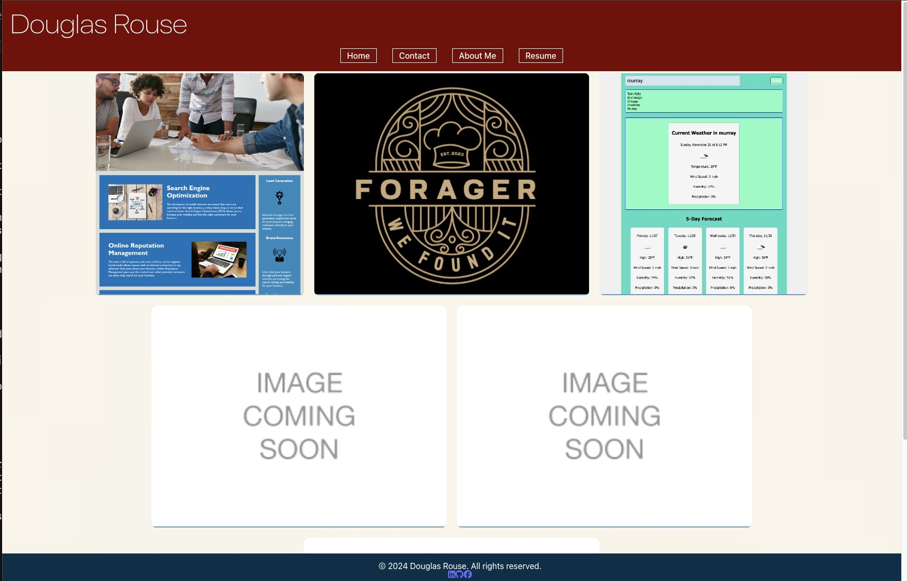

# Steve Rouse Portfolio

## Description
I created this page to showcase my app building skills in my portfolio.

## Table of Contents
- [Dev Tools Used](#dev-tools-used)
- [Links](#links)
- [License](#license)
- [Questions](#questions)

## Dev Tools Used
HTML/CSS  
JavaScript  
React  
Vite  
ESLint  
FontAwesome

## Links
Github: https://github.com/dougyfresh208/react-portfolio  
Deployed site: https://symphonious-pastelito-8d2626.netlify.app

## License

This project is licensed under the MIT license.

## Questions
For questions, contact dougrouseltw@gmail.com. Visit [GitHub](https://github.com/dougyfresh208).